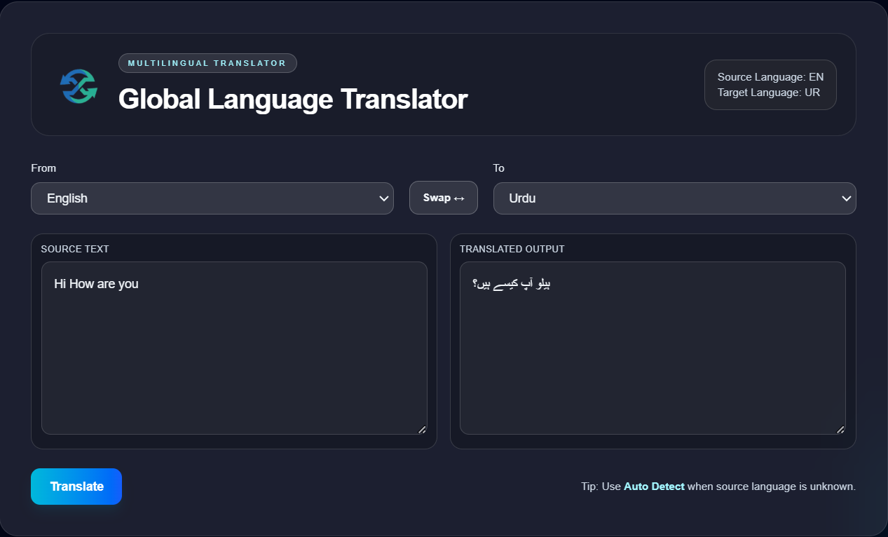

# Global Language Translator



A modern, responsive multilingual translator built with **Next.js**, **React**, **TypeScript**, and **Tailwind CSS**. This project is designed as a university final project for an AI course and provides a user-friendly interface to translate text between many languages using a backend API route inside the same Next.js app.

## 🚀 Project Overview

This application allows users to:
- Enter source text and choose a language to translate from
- Select a target language for translation
- Swap languages easily
- View translated output instantly
- See source and target language status in the header

The translator uses the `translate-google` package to perform translations on the server side through a Next.js API route.

## 📁 Structure

- `frontend/` — main application directory
  - `src/app/` — Next.js app pages and layout
  - `src/app/api/translate/route.ts` — translation API endpoint
  - `public/` — static assets including `lt_logo.png` and `image.png`

## 🛠️ Features

- Responsive layout for mobile, tablet, and desktop
- Modern glassmorphism UI with translucent cards and gradients
- In-app translation API route (`POST /api/translate`)
- Language swap button with auto-detect support
- Favicon and site logo integration
- Footer with project attribution

## 💻 Installation

```bash
cd frontend
npm install
```

## ▶️ Run Locally

```bash
cd frontend
npm run dev
```

Then open:

```text
http://localhost:3000
```

## 📦 Build for Production

```bash
cd frontend
npm run build
npm run start
```

## 🔧 API Usage

The translation endpoint is available at:

```text
POST /api/translate
```

Example request payload:

```json
{
  "text": "Hello world",
  "source_language": "en",
  "target_language": "ur"
}
```

## ☁️ Deployment

This app can be deployed on Vercel, Netlify, or any hosting service that supports Next.js.

For Vercel:
1. Push the repository to GitHub.
2. Import the repository into Vercel.
3. Set the **Root Directory** to `frontend`.
4. Deploy.

No special environment variables are required for this setup.

## 🎓 University Project

This is a final project for the **4th semester AI course**.

### Team Members
- Muhammad Talha Tariq
- Ali Haider Naseer
- Hamza Ali Khan